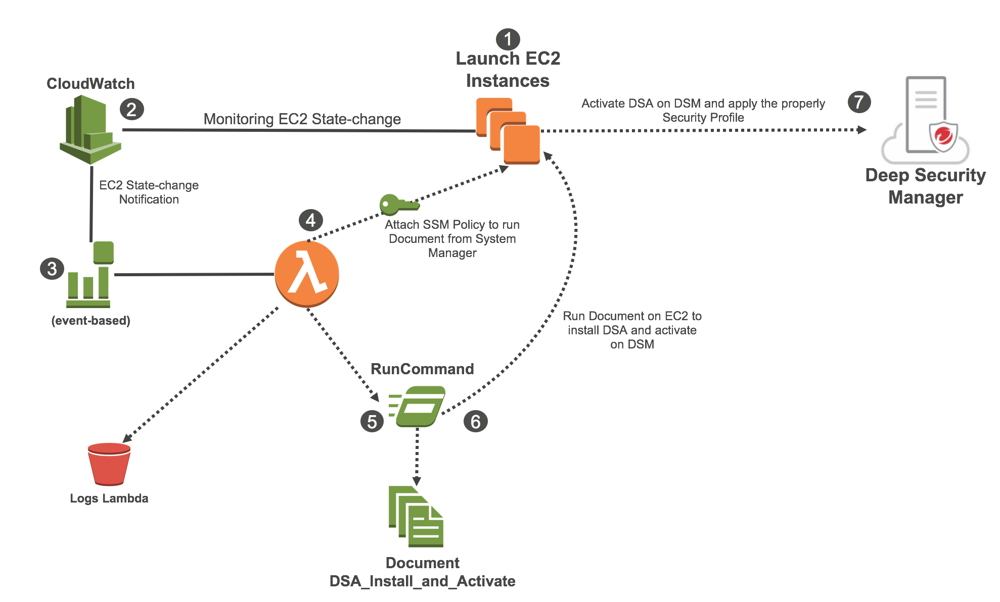

# Lambda_Function_Automation_to_Deploy_DSA
Automation processo to deploy and activate Deep Security Agents using Lambda Function

# Pending Features
  * Enable customer to add TenantID and TenantPass during the CF stack creation process
  * Enable customer to add S3Bucket and S3Key  during the CF stack creation process

# Improvements
  * Improve the checking Policy inside the Role when an EC2 has already a role applied
  
# Known Issues
  * Sometimes when you create a new EC2 without any Role applied or without the properly Policy to run SSM Document it's not able because the EC2 didnt get the properly IAM permission 
